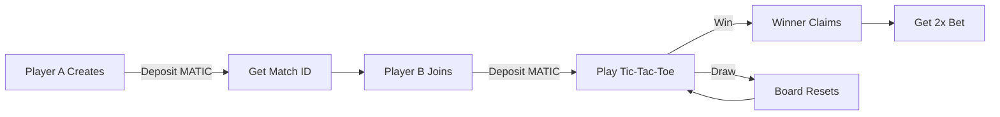

# 🎮 Polygon P2P Tic-Tac-Toe

```
                  ████████╗██╗ ██████╗    ████████╗ █████╗  ██████╗    ████████╗ ██████╗ ███████╗ 
                  ╚══██╔══╝██║██╔════╝    ╚══██╔══╝██╔══██╗██╔════╝    ╚══██╔══╝██╔═══██╗██╔════╝
                     ██║   ██║██║            ██║   ███████║██║            ██║   ██║   ██║█████╗  
                     ██║   ██║██║            ██║   ██╔══██║██║            ██║   ██║   ██║██╔══╝  
                     ██║   ██║╚██████╗       ██║   ██║  ██║╚██████╗       ██║   ╚██████╔╝███████╗
                     ╚═╝   ╚═╝ ╚═════╝       ╚═╝   ╚═╝  ╚═╝ ╚═════╝       ╚═╝    ╚═════╝ ╚══════╝

                                         ╔═══════╦═══════╦═══════╗
                                         ║       ║       ║       ║
                                         ║   X   ║   O   ║   X   ║
                                         ║       ║       ║       ║
                                         ╠═══════╬═══════╬═══════╣
                                         ║       ║       ║       ║
                                         ║   O   ║   X   ║   O   ║
                                         ║       ║       ║       ║
                                         ╠═══════╬═══════╬═══════╣
                                         ║       ║       ║       ║
                                         ║   X   ║   O   ║   X   ║
                                         ║       ║       ║       ║
                                         ╚═══════╩═══════╩═══════╝
```

<div align="center">

### 🚀 **The First Truly Decentralized P2P Betting Game** 🚀

[](https://p2p-tic-tac-toe-1063244275551.us-central1.run.app)
[](https://polygonscan.com/address/0x104739765FD82261F7a5005Af47ec6412484081c)
[](LICENSE)

**Bet MATIC. Play Tic-Tac-Toe. Winner Takes All.**

[🎮 Play Now](https://p2p-tic-tac-toe-1063244275551.us-central1.run.app) • [📖 Docs](SPEC.md) • [🐛 Report Bug](https://github.com/88448844/polygon-p2p-tictactoe/issues) • [✨ Request Feature](https://github.com/88448844/polygon-p2p-tictactoe/issues)

</div>

---

## 🎯 What Is This?

A **peer-to-peer betting platform** where two players can wager MATIC on a Tic-Tac-Toe game. The smart contract acts as **trustless escrow**, holding funds until there's a winner. No house edge. No intermediaries. Just you, your opponent, and the blockchain.

### 🌟 Why It's Special

```
┌─────────────────────────────────────────────────────────────────┐
│  💰 Bet Real Money     🎮 Play Classic Game     🏆 Winner Gets 95%  │
│  🔐 Trustless Escrow   ⚡ Instant Payouts      🎉 Epic Celebrations│
│  🌍 Low Fees (5%)      💎 Polygon Network      ⚡ Fast Settlement  │
└─────────────────────────────────────────────────────────────────┘
```

- **🎲 No Draws**: If there's a draw, the board auto-resets until someone wins
- **⚡ Real-Time**: Live updates via polling - see your opponent's moves instantly
- **💸 Fair Play**: Smart contract ensures winner gets 1.9x their bet (5% hosting fee)
- **🎨 Beautiful UI**: Minimalistic dark theme with confetti celebrations
- **📱 Mobile Ready**: Play on any device with MetaMask

---

## 🚀 Quick Start

### 1️⃣ Prerequisites
- [MetaMask](https://metamask.io/) browser extension
- Some MATIC on Polygon Mainnet ([Bridge here](https://wallet.polygon.technology/))

### 2️⃣ Play in 60 Seconds

```
1. 🌐 Open: https://p2p-tic-tac-toe-1063244275551.us-central1.run.app
2. 🦊 Connect MetaMask (auto-connects on load)
3. 💰 Create game OR join with Match ID
4. 🎮 Play Tic-Tac-Toe
5. 🏆 Winner claims prize!
```

### 3️⃣ How to Create a Game

```javascript
// Player A
1. Enter bet amount (e.g., 0.1 MATIC ≈ $0.10)
2. Click "Create Game"
3. Sign MetaMask transaction
4. Share your 6-digit Match ID with opponent
```

### 4️⃣ How to Join a Game

```javascript
// Player B  
1. Enter the 6-digit Match ID
2. Enter same bet amount
3. Click "Join Game"
4. Sign MetaMask transaction
5. Game starts!
```

---

## 💡 Features

<table>
<tr>
<td width="50%">

### 🎮 Gameplay
- ✅ Classic Tic-Tac-Toe rules
- ✅ Real-time move updates
- ✅ Auto-restart on draw
- ✅ 3-second confetti celebration
- ✅ Toast notifications for all actions

</td>
<td width="50%">

### 🔐 Security
- ✅ Smart contract escrow
- ✅ Cryptographic winner verification
- ✅ Backend signature authority
- ✅ Cannot cheat or steal funds
- ✅ Trustless settlement

</td>
- ✅ Auto wallet connection
- ✅ Minimalistic dark theme
- ✅ Fixed 3x3 grid (100px cells)
- ✅ Copy-to-clipboard Match ID
- ✅ Smooth animations

</td>
</tr>
</table>

---

## 🏗️ Architecture

```
┌─────────────┐       ┌──────────────┐       ┌─────────────────┐
│   MetaMask  │◄─────►│   Frontend   │◄─────►│     Backend     │
│  (Polygon)  │       │  (React)     │       │   (Node.js)     │
└──────┬──────┘       └──────────────┘       └────────┬────────┘
       │                                               │
       │         Deposits & Claims                     │ Auto-signs
       │              ↓                                 │ winners
       └──────────────┼─────────────────────────────────┘
                      ↓
           ┌──────────────────────┐
           │  UlaniWager Smart    │
           │  Contract (Polygon)  │
           │  Holds Funds Safely  │
           └──────────────────────┘
```

### Tech Stack

| Layer | Technology |
|-------|-----------|
| **Frontend** | React, Vite, ethers.js, canvas-confetti |
| **Backend** | Node.js, Express 4, ethers.js |
| **Blockchain** | Polygon Mainnet |
| **Smart Contract** | Solidity (UlaniWager) |
| **Deployment** | Google Cloud Run |
| **Wallet** | MetaMask |

---

## 🔐 How It Works

### The Smart Contract (Escrow)

```solidity
// Player A creates game
createWager(matchId) payable
→ Locks Player A's MATIC

// Player B joins
joinWager(matchId) payable  
→ Locks Player B's MATIC (must match A's bet)

// Winner claims prize
settle(matchId, winner, signature)
→ Verifies backend signature
→ Pays 95% of total pot to winner (5% hosting fee)
→ Winner receives 1.9x their original bet
```

### The Backend (Referee)

```javascript
// Tracks game state
- Board position
- Whose turn
- Win/draw detection

// Signs winners
signature = sign(chainId + matchId + winnerAddress)
→ Cryptographic proof of win
→ Only backend can create valid signatures
```

### Security Model

**Q: How do we prevent cheating?**

**A: Signature verification!**

```javascript
// Backend signs winner
const signature = backendWallet.sign(
  keccak256(chainId, matchId, winnerAddress)
);

// Contract verifies signature
address signer = ecrecover(signature);
require(signer == TRUSTED_BACKEND_ADDRESS);
// ✅ Only pays if signature is valid
```

🔐 **Players can't forge signatures** → Need backend's private key  
🔐 **Backend only signs actual winners** → Verified game state  
🔐 **Contract mathematically verifies** → Uses `ecrecover`  

---

## 📊 Game Flow



---

## 🛠️ Local Development

### Prerequisites
- Node.js 18+
- MetaMask with Polygon Mainnet
- Git

### Clone & Install

```bash
git clone https://github.com/88448844/polygon-p2p-tictactoe.git
cd polygon-p2p-tictactoe

# Install backend dependencies
cd backend
npm install

# Install frontend dependencies
cd ../frontend
npm install
```

### Environment Setup

**Backend** (`backend/.env`):
```env
PRIVATE_KEY=your_backend_wallet_private_key_without_0x
NODE_ENV=development
```

> ⚠️ **IMPORTANT**: Never commit `.env` files! They're in `.gitignore`.

**Frontend** (`frontend/.env`):
```env
VITE_API_URL=http://localhost:3000
```

### Run Locally

```bash
# Terminal 1: Start backend
cd backend
node server.js

# Terminal 2: Start frontend
cd frontend
npm run dev
```

Open http://localhost:5173 and connect MetaMask to Polygon Mainnet!

---

## 🚀 Deployment

### Deploy to Google Cloud Run

```bash
# Setup
gcloud auth login
gcloud config set project YOUR_PROJECT_ID

# Create secret for private key
echo -n "your_private_key" | gcloud secrets create BETTING_PRIVATE_KEY --data-file=-

# Deploy
gcloud run deploy p2p-tic-tac-toe \
  --source . \
  --region us-central1 \
  --allow-unauthenticated \
  --set-env-vars "NODE_ENV=production" \
  --set-secrets "PRIVATE_KEY=BETTING_PRIVATE_KEY:latest"
```

See [SPEC.md](SPEC.md) for detailed deployment guide.

---

## 📖 Documentation

- [📜 Technical Specification](SPEC.md) - Complete system architecture
- [🎮 Walkthrough](walkthrough.md) - Feature guide & testing
- [🏗️ Smart Contract](https://polygonscan.com/address/0x104739765FD82261F7a5005Af47ec6412484081c) - View on PolygonScan

---

## 🤝 Contributing

Contributions are welcome! Here's how:

1. Fork the repo
2. Create your feature branch (`git checkout -b feature/AmazingFeature`)
3. Commit your changes (`git commit -m 'Add some AmazingFeature'`)
4. Push to the branch (`git push origin feature/AmazingFeature`)
5. Open a Pull Request

---

## 📝 License

This project is licensed under the MIT License - see the [LICENSE](LICENSE) file for details.

---

## 🎉 Acknowledgments

- **Polygon Network** - For fast & cheap transactions
- **MetaMask** - For seamless wallet integration
- **React & Vite** - For amazing DX
- **ethers.js** - For blockchain interaction
- **Google Cloud Run** - For serverless hosting

---

<div align="center">

## 🌟 Star this repo if you like it! 🌟

**Made with ❤️ for the Polygon community**

[🎮 Play Now](https://p2p-tic-tac-toe-1063244275551.us-central1.run.app) • [📖 Read Docs](SPEC.md) • [🐛 Report Issues](https://github.com/88448844/polygon-p2p-tictactoe/issues)

```
                                         ╔═══════╦═══════╦═══════╗
                                         ║       ║       ║       ║
                                         ║   X   ║   O   ║   X   ║
                                         ║       ║       ║       ║
                                         ╠═══════╬═══════╬═══════╣
                                         ║       ║       ║       ║
                                         ║   O   ║   X   ║   O   ║
                                         ║       ║       ║       ║
                                         ╠═══════╬═══════╬═══════╣
                                         ║       ║       ║       ║
                                         ║   X   ║   O   ║   X   ║
                                         ║       ║       ║       ║
                                         ╚═══════╩═══════╩═══════╝
```

**🎯 No draws. Only winners. 🏆**

</div>
