# P2P Tic-Tac-Toe Betting System - Technical Specification

## Overview

This document provides a complete technical specification of the P2P Tic-Tac-Toe betting system, explaining how the smart contract, backend, and frontend work together to enable trustless peer-to-peer wagering on Tic-Tac-Toe games.

---

## 🎯 System Architecture

### Components

```
┌─────────────────┐      ┌──────────────────┐      ┌─────────────────────┐
│                 │      │                  │      │                     │
│  MetaMask       │◄────►│  Frontend (React)│◄────►│  Backend (Node.js)  │
│  (Polygon)      │      │  + ethers.js     │      │  + ethers.js        │
│                 │      │                  │      │                     │
└────────┬────────┘      └──────────────────┘      └──────────┬──────────┘
         │                                                    │
         │                                                    │
         └────────────────────┬───────────────────────────────┘
                              │
                    ┌─────────▼──────────┐
                    │                    │
                    │  UlaniWager Smart  │
                    │  Contract (Polygon)│
                    │  0x1047397...      │
                    │                    │
                    └────────────────────┘
```

### Technology Stack

| Layer | Technology | Purpose |
|-------|-----------|---------|
| **Frontend** | React + Vite | User interface |
| **Wallet** | MetaMask + ethers.js | Blockchain interaction |
| **Backend** | Node.js + Express 4 | Game state & auto-signing |
| **Blockchain** | Polygon Mainnet | Trustless escrow & settlement |
| **Smart Contract** | UlaniWager (Solidity) | Wager management |
| **Deployment** | Google Cloud Run | Serverless hosting |

---

## 📜 Smart Contract: `UlaniWager`

### Contract Address
```
0x104739765FD82261F7a5005Af47ec6412484081c (Polygon Mainnet)
```

### Contract ABI
```javascript
[
  "function createWager(uint256 matchId) external payable",
  "function joinWager(uint256 matchId) external payable",
  "function settle(uint256 matchId, address winner, bytes memory signature) external",
  "function cancelWager(uint256 matchId) external",
  "function wagers(uint256) view returns (address playerA, address playerB, uint256 stake, bool joined, bool settled, address winner)"
]
```

### How The Contract Works

#### 1. **Wager Structure**
Each wager is identified by a unique `matchId` (6-digit number) and stores:
- `playerA`: Address of game creator
- `playerB`: Address of game joiner
- `stake`: Amount of MATIC deposited (per player)
- `joined`: Boolean indicating if Player B has joined
- `settled`: Boolean indicating if prize has been claimed
- `winner`: Address of winner (or address(0) if not settled)

#### 2. **Contract Functions**

##### `createWager(uint256 matchId)` - Player A Creates Game
```solidity
// Player A calls this with MATIC deposit
// Example: createWager(123456) with 0.1 MATIC
```
- **Who calls**: Player A via MetaMask
- **When**: After getting matchId from backend
- **What it does**:
  - Stores `msg.sender` as `playerA`
  - Stores `msg.value` as `stake`
  - Locks MATIC in contract
  - Sets `joined = false`

##### `joinWager(uint256 matchId)` - Player B Joins Game
```solidity
// Player B calls this with matching MATIC deposit
// Example: joinWager(123456) with 0.1 MATIC
```
- **Who calls**: Player B via MetaMask
- **When**: After entering matchId in UI
- **What it does**:
  - Verifies `msg.value == stake` (must match Player A)
  - Stores `msg.sender` as `playerB`
  - Locks Player B's MATIC in contract
  - Sets `joined = true`
  - Total locked: 2x stake (0.2 MATIC in example)

##### `settle(uint256 matchId, address winner, bytes memory signature)` - Claim Prize
```solidity
// Winner calls this with backend-generated signature
// Example: settle(123456, 0xWinnerAddress, signature)
```
- **Who calls**: Winner via frontend "Claim Prize" button
- **When**: After game is won
- **What it does**:
  - Verifies signature using `ecrecover` (prevents cheating)
  - Checks signature was created by trusted backend wallet
  - Transfers 2x stake to winner
  - Sets `settled = true`
  - Emits event

##### `cancelWager(uint256 matchId)` - Refund (Not Used in UI)
```solidity
// Player A can cancel if Player B never joins
```
- **Who calls**: Player A (optional functionality)
- **When**: If opponent never shows up
- **What it does**:
  - Refunds Player A's stake if `joined = false`

---

## 🔄 Complete System Flow

### Phase 1: Game Creation (Player A)


**Backend Code (`/createGame`)**:
```javascript
app.post('/createGame', (req, res) => {
  const { playerA } = req.body;
  const matchId = Math.floor(100000 + Math.random() * 900000).toString();

  gamesDb.set(matchId, {
    matchId,
    playerA: playerA.toLowerCase(),
    playerB: null,
    board: Array(9).fill(null),
    turn: playerA.toLowerCase(),
    winner: null,
    status: 'WAITING',
    signature: null
  });

  res.json({ success: true, matchId });
});
```

**Frontend Code**:
```javascript
const createGame = async () => {
  // A. Create on Backend
  const res = await fetch(`${API_URL}/createGame`, {
    method: 'POST',
    headers: { 'Content-Type': 'application/json' },
    body: JSON.stringify({ playerA: account })
  });
  const data = await res.json();
  const newMatchId = data.matchId;

  // B. Create on Blockchain
  const contract = await getContract();
  const tx = await contract.createWager(newMatchId, { 
    value: ethers.parseEther(betAmount) 
  });
  await tx.wait();
};
```

---

### Phase 2: Joining Game (Player B)


**Backend Code (`/joinGame`)**:
```javascript
app.post('/joinGame', (req, res) => {
  const { matchId, playerB } = req.body;
  const game = gamesDb.get(matchId);

  if (!game) return res.status(404).json({ error: "Game not found" });
  if (game.playerB) return res.status(400).json({ error: "Game full" });

  game.playerB = playerB.toLowerCase();
  game.status = 'PLAYING';

  res.json({ success: true });
});
```

---

### Phase 3: Playing the Game


**Move Handling Code**:
```javascript
app.post('/makeMove', async (req, res) => {
  const { matchId, player, index } = req.body;
  const game = gamesDb.get(matchId);

  // Validate move
  if (game.turn !== player.toLowerCase()) return res.status(400).json({ error: "Not your turn" });
  if (game.board[index]) return res.status(400).json({ error: "Cell taken" });

  // Update board
  const symbol = (player.toLowerCase() === game.playerA) ? 'X' : 'O';
  game.board[index] = symbol;

  // Check for win
  const winnerSymbol = checkWin(game.board);
  if (winnerSymbol) {
    game.status = 'COMPLETED';
    game.winner = (winnerSymbol === 'X') ? game.playerA : game.playerB;

    // AUTO-SIGN: Generate cryptographic proof of winner
    const chainId = 137; // Polygon
    const messageHash = ethers.solidityPackedKeccak256(
      ['uint256', 'uint256', 'address'],
      [chainId, matchId, game.winner]
    );
    game.signature = await SIGNER_WALLET.signMessage(ethers.getBytes(messageHash));
  }
  // Check for draw
  else if (!game.board.includes(null)) {
    // Reset board and continue
    game.board = Array(9).fill(null);
  }
  // Continue game
  else {
    game.turn = (game.turn === game.playerA) ? game.playerB : game.playerA;
  }

  res.json({ success: true, game });
});
```

---

### Phase 4: Claiming Prize (Winner)

```mermaid
sequenceDiagram
    participant Winner
    participant Frontend
    participant Backend
    participant Contract
    
    Winner->>Frontend: Click "Claim Prize"
    Frontend->>Backend: GET /gameState/{matchId}
    Backend-->>Frontend: {winner, signature}
    
    Frontend->>Winner: Prompt MetaMask signature
    Winner->>Contract: settle(matchId, winnerAddress, signature)
    
    Contract->>Contract: Verify signature using ecrecover
    Contract->>Contract: Ensure signer is trusted backend wallet
    Contract->>Contract: Transfer 2x stake to winner
    Contract->>Winner: Send 0.2 MATIC (minus gas)
    Contract-->>Winner: Transaction confirmed
    
    Frontend->>Winner: Show "Prize claimed! 💰" + confetti 🎉
```



**Claim Prize Code**:
```javascript
const claimPrize = async () => {
  const contract = await getContract();
  
  // Call settle with backend-generated signature
  const tx = await contract.settle(
    matchId,                // Game ID
    account,               // Winner address
    gameState.signature    // Backend signature (proof of win)
  );
  
  await tx.wait();
  // Winner receives 2x the bet amount
};
```

---

## 🔐 Security: How the Signature System Works

### The Problem
How do we prevent:
- Player A claiming they won when they lost?
- Players settling the contract without actually winning?
- Fake winners draining the contract?

### The Solution: Backend Signature Authority

#### 1. **Backend Holds Private Key**
```javascript
const PRIVATE_KEY = process.env.PRIVATE_KEY; // Securely stored in Secret Manager
const SIGNER_WALLET = new ethers.Wallet(PRIVATE_KEY);
```

#### 2. **Backend Signs Winner**
When a win is detected, the backend creates a cryptographic signature:

```javascript
const chainId = 137; // Polygon Mainnet
const messageHash = ethers.solidityPackedKeccak256(
  ['uint256', 'uint256', 'address'],
  [chainId, matchId, winnerAddress]
);

const signature = await SIGNER_WALLET.signMessage(ethers.getBytes(messageHash));
```

This signature proves:
- The backend (trusted authority) verified the winner
- The winner address is legitimate
- The matchId is correct
- This is for Polygon Mainnet (chainId 137)

#### 3. **Contract Verifies Signature**
The smart contract's `settle()` function:
1. Reconstructs the same messageHash
2. Uses `ecrecover` to extract the signer address from the signature
3. Compares it to the trusted backend wallet address
4. Only pays out if the signature is valid

**Solidity Example**:
```solidity
function settle(uint256 matchId, address winner, bytes memory signature) external {
    bytes32 messageHash = keccak256(abi.encodePacked(block.chainid, matchId, winner));
    bytes32 ethSignedMessageHash = keccak256(abi.encodePacked("\x19Ethereum Signed Message:\n32", messageHash));
    
    address signer = ecrecover(ethSignedMessageHash, v, r, s);
    require(signer == TRUSTED_BACKEND, "Invalid signature");
    
    // Transfer prize to winner
    payable(winner).transfer(stake * 2);
}
```

### Why This Is Secure
✅ **Only the backend** can create valid signatures (has the private key)  
✅ **Backend verifies game state** before signing (checks who actually won)  
✅ **Smart contract verifies** the signature came from the backend  
✅ **Cannot be forged** without stealing the backend's private key  
✅ **Immutable proof** - signature can't be changed after creation  

---

## 🎮 Draw Restart Logic

### The Problem
Original behavior: If there's a draw, the game ends with no winner and both players lose their stakes.

### The Solution
When a draw is detected, automatically reset the board and continue playing until there's a winner.

**Backend Implementation**:
```javascript
} else if (!game.board.includes(null)) {
    // DRAW - Reset board and continue playing
    console.log(`[GAME] ${matchId} DRAW - Resetting board for next round`);
    game.board = Array(9).fill(null);
    // Same player starts next round (fairness)
}
```

**Frontend Detection**:
```javascript
const fetchGameState = async () => {
  const prevBoard = gameState?.board;
  const data = await res.json();
  
  // Detect board reset (draw scenario)
  if (prevBoard && !prevBoard.includes(null) && 
      data.board && data.board.every(cell => cell === null)) {
    showToast("Draw! Board reset - keep playing!", "info");
  }
};
```

---

## 🔧 Replication Guide

### Prerequisites
1. Smart contract deployed on Polygon with:
   - `createWager(uint256)` function
   - `joinWager(uint256)` function
   - `settle(uint256, address, bytes)` function
   - Trusted backend address configured
2. Backend wallet with private key
3. Google Cloud project (for Cloud Run deployment)

### Step 1: Smart Contract
Deploy `UlaniWager` to Polygon with your backend wallet address as the trusted signer.

### Step 2: Backend Setup
```bash
cd backend
npm install cors dotenv ethers@6.15.0 express@4.18.2

# Create .env
echo "PRIVATE_KEY=your_private_key_without_0x" > .env
echo "NODE_ENV=development" >> .env
```

**server.js structure**:
- In-memory Map for game state
- Auto-sign winners using `ethers.Wallet`
- Endpoints: `/createGame`, `/joinGame`, `/makeMove`, `/gameState/:matchId`

### Step 3: Frontend Setup
```bash
cd frontend
npm install react vite ethers@6.15.0 canvas-confetti

# Create .env
echo "VITE_API_URL=http://localhost:3000" > .env
```

**src/utils/contract.js**:
```javascript
export const CONTRACT_ADDRESS = "0x104739765FD82261F7a5005Af47ec6412484081c";
export const CONTRACT_ABI = [
  "function createWager(uint256 matchId) external payable",
  "function joinWager(uint256 matchId) external payable",
  "function settle(uint256 matchId, address winner, bytes memory signature) external",
  "function wagers(uint256) view returns (address, address, uint256, bool, bool, address)"
];
```

### Step 4: Deploy to Cloud Run
```bash
# Create .gcloudignore
echo "node_modules" > .gcloudignore
echo ".git" >> .gcloudignore
echo ".env" >> .gcloudignore

# Create secret
gcloud secrets create BETTING_PRIVATE_KEY --data-file=- < backend/.env

# Deploy
gcloud run deploy p2p-tic-tac-toe \
  --source . \
  --region us-central1 \
  --allow-unauthenticated \
  --set-env-vars "NODE_ENV=production" \
  --set-secrets "PRIVATE_KEY=BETTING_PRIVATE_KEY:latest"
```

---

## 📊 Data Flow Summary

### Player A Creates Game
1. **Frontend** → **Backend**: `POST /createGame` → Get matchId
2. **Frontend** → **Contract**: `createWager(matchId)` → Lock MATIC
3. **Frontend** polls **Backend**: `GET /gameState/{matchId}` every 2s

### Player B Joins Game
1. **Frontend** → **Contract**: `joinWager(matchId)` → Lock MATIC
2. **Frontend** → **Backend**: `POST /joinGame` → Update status
3. Game status changes to `PLAYING`

### Players Make Moves
1. **Frontend** → **Backend**: `POST /makeMove` → Update board
2. **Backend** checks win/draw, auto-signs if won
3. **Frontend** polls for updates, displays board

### Winner Claims Prize
1. **Frontend** → **Contract**: `settle(matchId, winner, signature)`
2. **Contract** verifies signature via `ecrecover`
3. **Contract** transfers 2x stake to winner
4. Frontend shows confetti 🎉

---

## 🎯 Key Design Decisions

| Decision | Rationale |
|----------|-----------|
| **6-digit matchId** | Easy to share and remember |
| **Backend auto-signing** | Prevents cheating, validated by contract |
| **In-memory game state** | Fast, simple, stateless backend |
| **Draw restart** | Ensures eventual winner, fair outcome |
| **Real-time polling** | Simple alternative to WebSockets |
| **Express 4 not 5** | v5 has breaking route changes |
| **npm install not ci** | Avoids package-lock conflicts |

---

## 🚀 Live Deployment

- **URL**: https://p2p-tic-tac-toe-1063244275551.us-central1.run.app
- **Contract**: 0x104739765FD82261F7a5005Af47ec6412484081c (Polygon)
- **Backend Signer**: Configured in Secret Manager
- **Status**: ✅ Production-ready

---

## 📝 Complete Code References

All implementation details can be found in:
1. **Smart Contract ABI**: `frontend/src/utils/contract.js`
2. **Backend Logic**: `backend/server.js`
3. **Frontend Logic**: `frontend/src/App.jsx`
4. **Deployment Config**: `Dockerfile`, `.gcloudignore`, `deploy_fixed.ps1`

This specification provides everything needed to understand and replicate the P2P Tic-Tac-Toe betting system.
